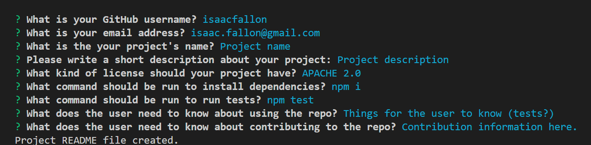
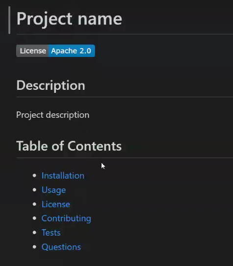

# 9-Challenge-Professional-README-Generator

## Description

This project is a README generator application using the Node.JS command line interface ['inquirer'](https://www.npmjs.com/package/inquirer). It serves as the week 9 challenge for The University of Sydney's Coding Bootcamp.

This application was built to serve as a more efficient  way to create a README.md file for a project. 

By using this README generator, the user does not need to manually enter in the details for their README file which solves a problem of possibly creating an inaccurate or subpar README file to describe their project.

By building this project, I gained a solid understanding of how Node.JS functions and the importance of README files for a project. 

### Video showing how the application works:

To understand how the application runs and view a sample README file generated, please watch [a video demonstration here](https://drive.google.com/file/d/1Via0LklNxTisbEY8yMAe3ezf6Gls7_jQ/view). 

### Screenshot of application showing user input prompts:

The screenshot below shows all prompts made to the user via the inquirer command line interface:

The screenshot below shows a portion of a sample README.md file generated:

## Usage

To use this application, you'll need to firstly, clone the repository and run the project locally. [Refer to this guide from GitHub if you need help.](https://docs.github.com/en/repositories/creating-and-managing-repositories/cloning-a-repository/)

Once cloned, you will need to navigate to the project's folder in your terminal and run the command 'npm i' to install the necessary dependencies. 

Once the installation has completed, enter the command 'node index.js' to run the application. Once all prompts are answered, a new README_SAMPLE.md file should be generated in your project file. 

## Credits

My codebase utilises code from one external source.

To obtain the License badges generated in the README file, I referenced the [following GitHub Gist webpage](https://gist.github.com/lukas-h/2a5d00690736b4c3a7ba) from user [lukas-h](https://gist.github.com/lukas-h).

Full link to the webpage: https://gist.github.com/lukas-h/2a5d00690736b4c3a7ba

## License

MIT License

Copyright (c) 2024 isaacfallon

Permission is hereby granted, free of charge, to any person obtaining a copy
of this software and associated documentation files (the "Software"), to deal
in the Software without restriction, including without limitation the rights
to use, copy, modify, merge, publish, distribute, sublicense, and/or sell
copies of the Software, and to permit persons to whom the Software is
furnished to do so, subject to the following conditions:

The above copyright notice and this permission notice shall be included in all
copies or substantial portions of the Software.

THE SOFTWARE IS PROVIDED "AS IS", WITHOUT WARRANTY OF ANY KIND, EXPRESS OR
IMPLIED, INCLUDING BUT NOT LIMITED TO THE WARRANTIES OF MERCHANTABILITY,
FITNESS FOR A PARTICULAR PURPOSE AND NONINFRINGEMENT. IN NO EVENT SHALL THE
AUTHORS OR COPYRIGHT HOLDERS BE LIABLE FOR ANY CLAIM, DAMAGES OR OTHER
LIABILITY, WHETHER IN AN ACTION OF CONTRACT, TORT OR OTHERWISE, ARISING FROM,
OUT OF OR IN CONNECTION WITH THE SOFTWARE OR THE USE OR OTHER DEALINGS IN THE
SOFTWARE.